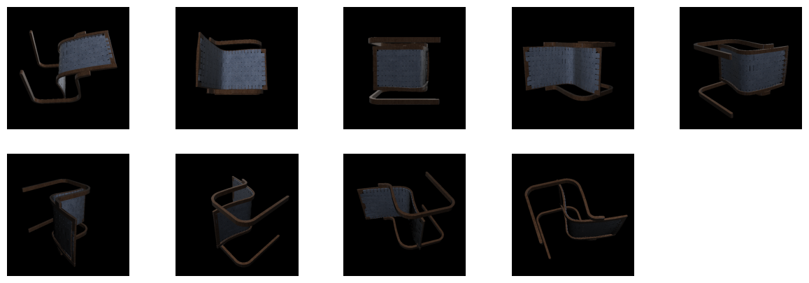
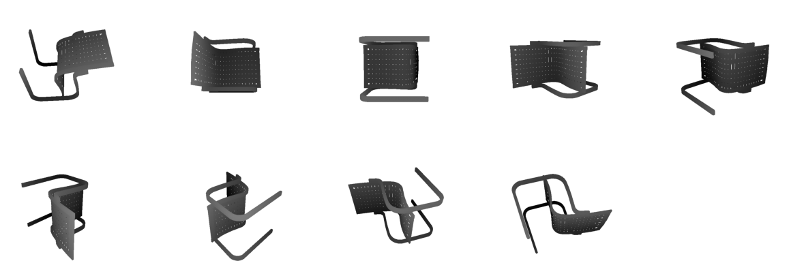

# Kaolin Easy Render Patch - Depth Map Support

## Quick Start
```python
from kaolin_render import render_glb_with_hammersley

images, depths = render_glb_with_hammersley("path/to/model.glb", num_views=10, res=512)
```

## What It Does
- Given a GLB, `render_glb_with_hammersley` orbits the camera with `sphere_hammersley_sequence` for view coverage and returns RGB frames plus matching depth maps.
- Each entry in `images` is an 8-bit RGB array; each entry in `depths` is a float depth map aligned per view.

## Sample Output



